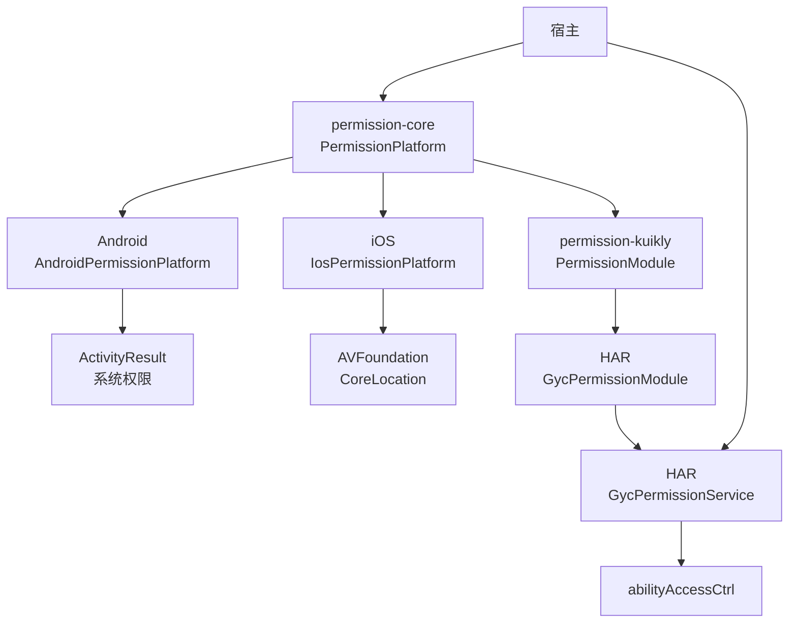
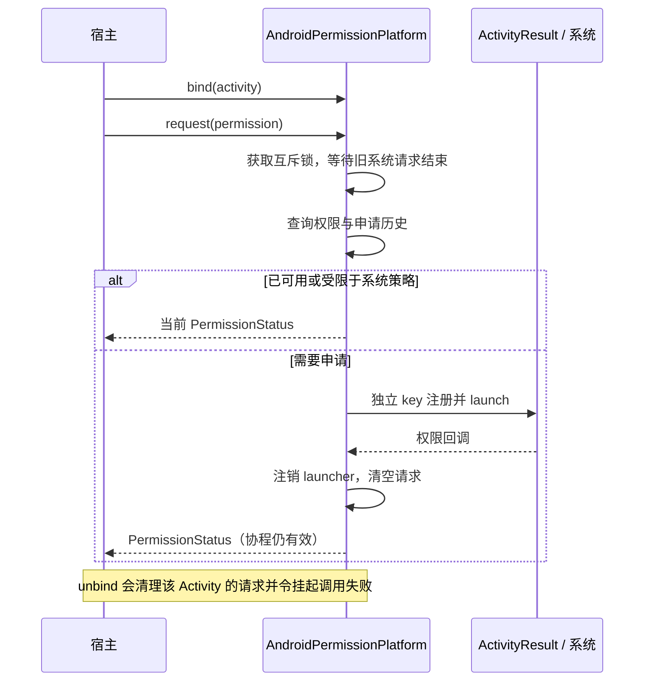
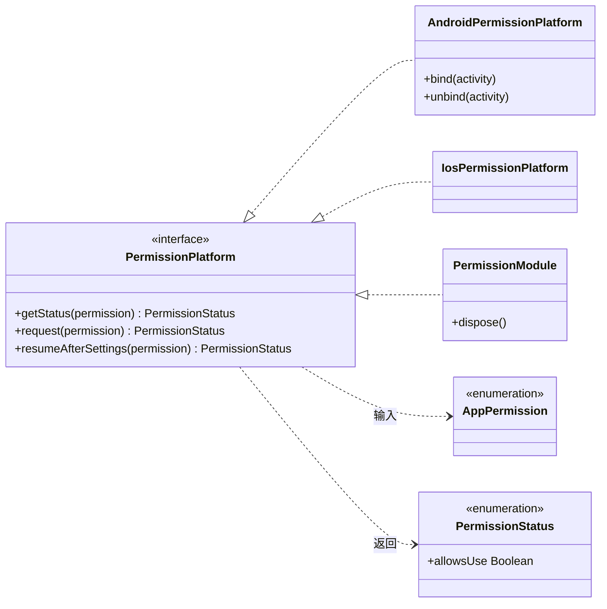

# GY CrossKit Permission

相机、麦克风和前台定位的权限状态查询与申请。宿主负责申请时机、说明文案、系统权限声明和应用设置页跳转。

## 0.1.4 prerelease

iOS 定位权限等待被后台取消时，把 continuation 归属判断与清理排回 Main；公开 API 保持兼容。

| 渠道 | 当前版本 | 状态 |
| --- | --- | --- |
| Maven core/Kuikly | 0.1.4 | prerelease 已发布，JitPack 制品审计通过；独立消费结果见验收文档 |
| HarmonyOS HAR | 0.1.2 | 原生源码未变，保持既有版本；Registry 状态沿用历史记录 |

[0.1.4 Release](https://github.com/gycrosskit/permission/releases/tag/0.1.4) 已提供固定 Maven 归档与 SHA256SUMS；JitPack 最终状态、精确 commit 和制品审计通过。源码回归、远程渠道限制及独立消费进度见 [0.1.4 远程发布验收](docs/0.1.4远程发布验收.md)，不代表生产宿主或真实设备验收通过。

Maven 0.1.2 已提供为 prerelease，默认 JitPack 的 Android/iOS/OHOS 消费验证通过。
HAR 0.1.2 已以 next 标签提交审核，registry 正式 latest 仍为 0.1.1；审核完成前使用既有 HAR。
0.1.1 历史渠道与验收记录保留。

## 0.1.3 prerelease

修复 Kuikly 回调已完成但协程尚未消费时页面销毁的迟交付；iOS 权限查询/申请内部使用主线程，定位 manager 在主线程延迟创建。移除未使用的 Compose 构建依赖，并补齐新 POM 的 Apache-2.0 元数据。

| 渠道 | 本轮版本 | 状态 |
| --- | --- | --- |
| Maven core/Kuikly | 0.1.3 | JitPack 全文件/hash 与 Android/OHOS/三 iOS 编译、Simulator 链接通过 |
| HarmonyOS HAR | 0.1.2 | 源码未变，沿用旧 Release 已验产物；OHPM 仍需核验审核结果 |


## 平台与要求

| 平台 | 接入方式 | 系统要求 |
| --- | --- | --- |
| Android | KMP `permission-core`，`AndroidPermissionPlatform` | API 24+，`ComponentActivity` |
| iOS | KMP `permission-core`，`IosPermissionPlatform` | iOS 14+（定位精度状态使用 iOS 14 API），无独立 Swift Package |
| HarmonyOS | `permission-kuikly` + 原生 HAR，或 ArkTS 直接使用 HAR | 当前 HAR 的 target/compatible SDK 均为 API 22 |

KMP 产物使用 Kotlin `2.2.21-1.0.0`、coroutines `1.10.2-1.0.0`；Kuikly 为 `2.28.0-2.0.21-ohos`。OHOS 宿主需要匹配的 Kotlin 工具链，完整仓库配置见接入指南。

## 架构与调用流程

`permission-core` 定义权限与状态；Android/iOS 实现负责系统申请，HarmonyOS 通过 Kuikly Module 或直接调用 HAR。宿主负责权限声明、申请时机与设置导航。



Android 申请串行执行；已经可用的权限直接返回，否则等待系统回调。协程取消不关闭系统弹窗，下次申请仍需等待真实回调或宿主解绑。



核心类型仅展示 KMP 公共契约与实现；虚线箭头表示依赖，空心三角指向被实现的接口。



源码：[公共入口与 AppPermission](permission-core/src/commonMain/kotlin/io/github/gycrosskit/permission/PermissionPlatform.kt)、[PermissionStatus](permission-core/src/commonMain/kotlin/io/github/gycrosskit/permission/PermissionStatus.kt)、[Android 实现](permission-core/src/androidMain/kotlin/io/github/gycrosskit/permission/AndroidPermissionPlatform.kt)、[iOS 实现](permission-core/src/iosMain/kotlin/io/github/gycrosskit/permission/IosPermissionPlatform.kt)、[Kuikly Module](permission-kuikly/src/commonMain/kotlin/io/github/gycrosskit/permission/kuikly/PermissionModule.kt)、[HAR Module](ohos/permission-native/src/main/ets/GycPermissionModule.ets)、[HAR Service](ohos/permission-native/src/main/ets/GycPermissionService.ets)。

## 安装

```kotlin
// settings.gradle.kts
dependencyResolutionManagement {
    repositories {
        exclusiveContent {
            forRepository {
                maven("https://mirrors.tencent.com/nexus/repository/maven-tencent/")
            }
            filter { includeGroup("com.tencent.kuikly-open") }
        }
        maven("https://jitpack.io")
        maven("https://maven.eazytec-cloud.com/nexus/repository/maven-public/")
        google()
        mavenCentral()
    }
}
```

```kotlin
// build.gradle.kts: kotlin.sourceSets
commonMain.dependencies {
    implementation("com.github.gycrosskit.permission:permission-core:0.1.4")
}
// HarmonyOS Kuikly 宿主额外添加
ohosArm64Main.dependencies {
    implementation("com.github.gycrosskit.permission:permission-kuikly:0.1.4")
}
```

HarmonyOS 原生包独立安装，不由 Maven 依赖自动携带；以下 0.1.2 命令需等待审核可见，当前正式版本为 0.1.1：

```sh
ohpm install @gycrosskit/permission-native@0.1.2
```

## 最小使用

```kotlin
import io.github.gycrosskit.permission.*

// Android 宿主创建时绑定，同一实例可供页面使用。
val permissions = AndroidPermissionPlatform()
permissions.bind(activity)
// 在绑定页面生命周期的协程内，由用户操作触发：
val status = permissions.request(AppPermission.CAMERA)
// Activity 销毁时：
permissions.unbind(activity)
```

iOS 用 `IosPermissionPlatform()` 替代 Android 实现，无需绑定 UIViewController；内部切换主线程执行。HarmonyOS 使用 `GycPermissionService` 或注册 Kuikly `PermissionModule`，见接入指南。

Android 媒体执行器可复用原历史范围，不依赖 media 或业务结果类型：

```kotlin
val cameraHistory = AndroidPermissionRequestHistory() // 每个 picker 一个实例
// 旧写相册权限的历史对象由宿主进程范围持有并注入，避免替换 saver 时丢失申请事实。
val state = activity.requestRuntimePermission(android.Manifest.permission.CAMERA, cameraHistory)
// 宿主映射 AndroidRuntimePermissionState 到 MediaPermissionState：
// GRANTED -> GRANTED；REQUESTED_WITHOUT_RATIONALE -> BLOCKED；其余 -> DENIED。
```

默认历史仅在对象实例内；传 `preferencesName` 可沿用旧 namespace 持久化，同一历史对象可由多个调用方共享。
`AndroidPermissionPlatform(requestHistory = history)` 也支持显式注入，原 `historyPreferencesName` 参数保持。
首次/仍有 rationale 时申请；刚拒绝返回 DENIED，下次主动申请才根据历史与 rationale 返回
REQUESTED_WITHOUT_RATIONALE。协程取消、结果交付和启动失败均注销本次 ActivityResult launcher。
此执行器不提供相册权限管理、设置导航或媒体业务映射，旧系统 WRITE_EXTERNAL_STORAGE 仍由宿主按需声明。

## 权限与生命周期

状态为 `NOT_DETERMINED / GRANTED / LIMITED / DENIED / RESTRICTED`；`LIMITED` 表示可用但受限，例如粗略定位。Android `DENIED` 不等于永久拒绝，设置返回后调用 `resumeAfterSettings` 重新判断。Android 宿主解绑会让属于该页面的挂起申请失败；取消协程不能强制关闭系统授权弹窗，迟到结果不会交给新请求。

Android Manifest 按需声明 `CAMERA`、`RECORD_AUDIO`、`ACCESS_COARSE_LOCATION`、`ACCESS_FINE_LOCATION`；iOS Info.plist 按需填写 `NSCameraUsageDescription`、`NSMicrophoneUsageDescription`、`NSLocationWhenInUseUsageDescription`，缺少声明可能导致系统终止应用。HarmonyOS 声明实际使用的相机、麦克风或前台定位权限。Kuikly Module 每页一个实例，页面结束时调用 `dispose()`。

不提供后台定位、相册权限管理或自动设置页导航。编译与远程依赖验证不代替真机权限弹窗和设置页往返验收。

## 文档与帮助

- [接入指南](docs/接入指南.md)：平台初始化、权限声明和生命周期。
- [开发与验证](docs/开发与验证.md)：源码构建、检查命令与验收范围。
- [版本与发行说明](https://github.com/gycrosskit/permission/releases)、[问题反馈](https://github.com/gycrosskit/permission/issues)。

Apache-2.0，见 [LICENSE](LICENSE)。

本轮状态见 [0.1.4 远程发布验收](docs/0.1.4远程发布验收.md)；既有制品与远程记录见 [0.1.3 发布验收](docs/发布验收-0.1.3.md)。
