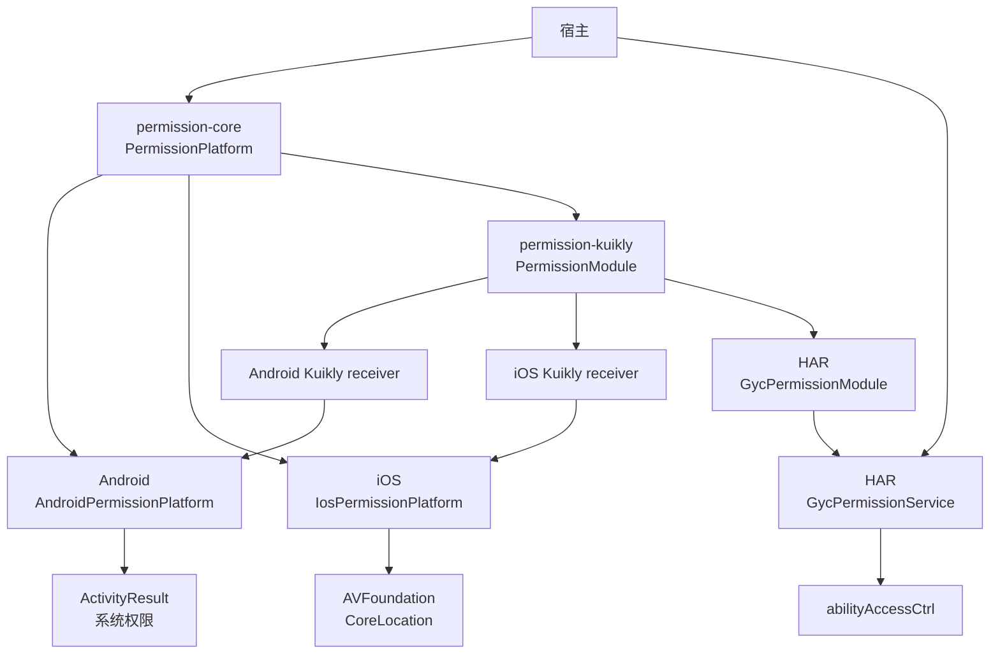
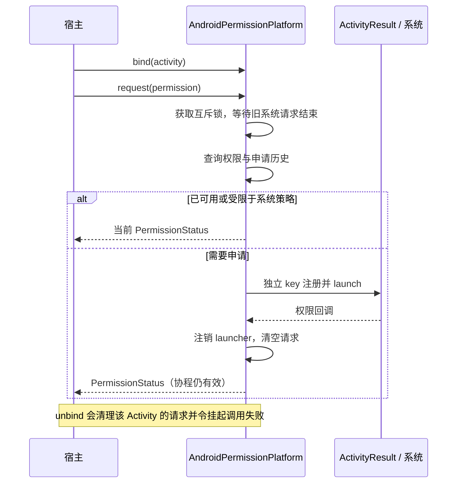
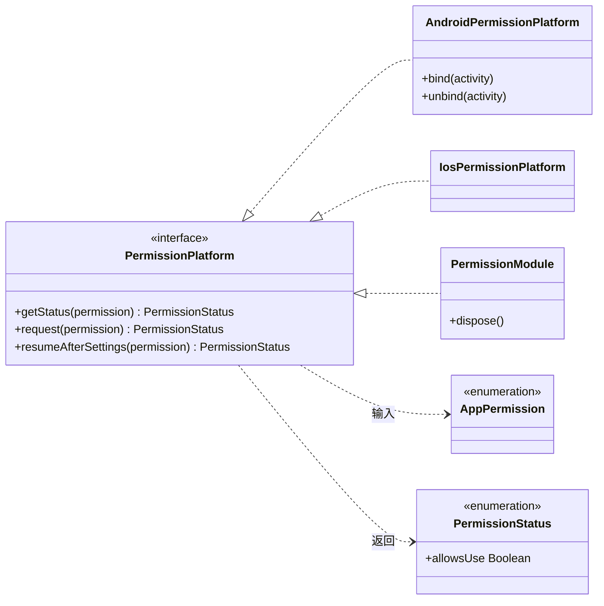

# GY CrossKit Permission

本版源码 Maven `0.1.9` 提供 `permission-kuikly` Android、iosArm64、iosX64、iosSimulatorArm64 targets、原生 receiver 和每 Renderer handler。iOS 可选 Pod `GycPermissionKuikly/Kuikly` `0.1.9` 使用真实 `OpenKuiklyIOSRender 2.28.0`；Kotlin handler 由宿主已有 Shared framework 导出。发布与远程消费状态以[对应 Release](https://github.com/gycrosskit/permission/releases/tag/0.1.9)为准。历史基线 Maven `0.1.8` 的 `-kuikly` 仅含 OHOS 变体；原 HAR 沿用。宿主需注册并维护已有原生能力 owner，示例见[接入指南](docs/接入指南.md#androidios-kuikly-native-module)。


## 当前功能与平台边界

core 提供相机、麦克风、前台定位的五种权限状态及申请/恢复；无CMP UI模块，permission-kuikly包含三端 Module 与 Android/iOS receiver，复用宿主已有原生 owner。

历史发布基线：Maven 0.1.8；HAR 0.1.6沿用原字节。远程验收以固定 Release 结果为准。本次修复与平台边界见[功能与平台差异](docs/功能与平台差异.md)，构建与渠道验收见[版本发布记录](https://github.com/gycrosskit/permission/releases/tag/0.1.8)；下方旧版本记录保留其历史范围。

当前测试覆盖、执行时点和未验收项集中见[验证范围](docs/功能与平台差异.md#验证范围)，复现命令见[开发与验证](docs/开发与验证.md)。

此版本包含已复核的跨端行为修复；[历史源码候选记录](docs/跨端行为候选.md)和下方旧版验收保持其原时点，当前范围见顶部功能与平台差异。

[历史完整源码审查](docs/完整源码审查.md) 列出全部生产文件、公开调用链、实际验证与未测项。

相机、麦克风和前台定位的权限状态查询与申请。宿主负责申请时机、说明文案、系统权限声明和应用设置页跳转。

此版本将 Android `isPermissionRevokedByPolicy` 映射为 `RESTRICTED`；已有完整/粗略授权优先，设备策略限制不引导为普通设置恢复。

## 平台与要求

| 平台 | 接入方式 | 系统要求 |
| --- | --- | --- |
| Android | KMP `permission-core`，`AndroidPermissionPlatform` | API 24+，`ComponentActivity` |
| iOS | KMP `permission-core`，`IosPermissionPlatform` | iOS 14+（定位精度状态使用 iOS 14 API），无独立 Swift Package |
| HarmonyOS | `permission-kuikly` + 原生 HAR，或 ArkTS 直接使用 HAR | 当前 HAR 的 target/compatible SDK 均为 API 22 |

KMP 产物使用 Kotlin `2.2.21-1.0.0`、coroutines `1.10.2-1.0.0`；Kuikly 为 `2.28.0-2.0.21-ohos`。OHOS 宿主需要匹配的 Kotlin 工具链，完整仓库配置见接入指南。

## 架构与调用流程

`permission-core` 定义权限与状态；Android/iOS 实现负责系统申请，HarmonyOS 通过 Kuikly Module 或直接调用 HAR。宿主负责权限声明、申请时机与设置导航。



Android 申请串行执行；已经可用的权限直接返回，否则等待系统回调。协程取消不关闭系统弹窗，下次申请仍需等待真实回调或宿主解绑。



核心类型仅展示 KMP 公共契约与实现；虚线箭头表示依赖，空心三角指向被实现的接口。



源码：[公共入口与 AppPermission](permission-core/src/commonMain/kotlin/io/github/gycrosskit/permission/PermissionPlatform.kt)、[PermissionStatus](permission-core/src/commonMain/kotlin/io/github/gycrosskit/permission/PermissionStatus.kt)、[Android 实现](permission-core/src/androidMain/kotlin/io/github/gycrosskit/permission/AndroidPermissionPlatform.kt)、[iOS 实现](permission-core/src/iosMain/kotlin/io/github/gycrosskit/permission/IosPermissionPlatform.kt)、[Kuikly Module](permission-kuikly/src/commonMain/kotlin/io/github/gycrosskit/permission/kuikly/PermissionModule.kt)、[HAR Module](ohos/permission-native/src/main/ets/GycPermissionModule.ets)、[HAR Service](ohos/permission-native/src/main/ets/GycPermissionService.ets)。

## 安装

```kotlin
// settings.gradle.kts
dependencyResolutionManagement {
    repositories {
        exclusiveContent {
            forRepository {
                maven("https://mirrors.tencent.com/nexus/repository/maven-tencent/")
            }
            filter { includeGroup("com.tencent.kuikly-open") }
        }
        maven("https://jitpack.io")
        maven("https://maven.eazytec-cloud.com/nexus/repository/maven-public/")
        google()
        mavenCentral()
    }
}
```

```kotlin
// build.gradle.kts: kotlin.sourceSets
commonMain.dependencies {
    implementation("com.github.gycrosskit.permission:permission-core:0.1.8")
}
// HarmonyOS Kuikly 宿主额外添加
ohosArm64Main.dependencies {
    implementation("com.github.gycrosskit.permission:permission-kuikly:0.1.8")
}
```

HarmonyOS 原生包独立安装，不由 Maven 依赖自动携带；当前保留 HAR `0.1.6`。精确 Registry 安装与固定 [0.1.6 Release HAR](https://github.com/gycrosskit/permission/releases/tag/0.1.6) 消费分别验收，实际状态见顶部版本发布记录：

```sh
ohpm install @gycrosskit/permission-native@0.1.6
```

## 最小使用

```kotlin
import io.github.gycrosskit.permission.*

// Android 宿主创建时绑定，同一实例可供页面使用。
val permissions = AndroidPermissionPlatform()
permissions.bind(activity)
// 在绑定页面生命周期的协程内，由用户操作触发：
val status = permissions.request(AppPermission.CAMERA)
// Activity 销毁时：
permissions.unbind(activity)
```

iOS 用 `IosPermissionPlatform()` 替代 Android 实现，无需绑定 UIViewController；内部切换主线程执行。HarmonyOS 使用 `GycPermissionService` 或注册 Kuikly `PermissionModule`，见接入指南。

Android 媒体执行器可复用原历史范围，不依赖 media 或业务结果类型：

```kotlin
val cameraHistory = AndroidPermissionRequestHistory() // 每个 picker 一个实例
// 旧写相册权限的历史对象由宿主进程范围持有并注入，避免替换 saver 时丢失申请事实。
val state = activity.requestRuntimePermission(android.Manifest.permission.CAMERA, cameraHistory)
// 宿主映射 AndroidRuntimePermissionState 到 MediaPermissionState：
// GRANTED -> GRANTED；REQUESTED_WITHOUT_RATIONALE -> BLOCKED；其余 -> DENIED。
```

默认历史仅在对象实例内；传 `preferencesName` 可沿用旧 namespace 持久化，同一历史对象可由多个调用方共享。
`AndroidPermissionPlatform(requestHistory = history)` 也支持显式注入，原 `historyPreferencesName` 参数保持。
首次/仍有 rationale 时申请；刚拒绝返回 DENIED，下次主动申请才根据历史与 rationale 返回
REQUESTED_WITHOUT_RATIONALE。协程取消、结果交付和启动失败均注销本次 ActivityResult launcher。
此执行器不提供相册权限管理、设置导航或媒体业务映射，旧系统 WRITE_EXTERNAL_STORAGE 仍由宿主按需声明。

## 权限与生命周期

Android 权限 Launcher 注册/启动失败会完整释放本次等待并传播异常，只在系统受理后记录申请历史；HAR 入口导出 `GycPermission` / `GycPermissionStatus` 类型。

状态为 `NOT_DETERMINED / GRANTED / LIMITED / DENIED / RESTRICTED`；`LIMITED` 表示可用但受限，例如粗略定位。Android `DENIED` 不等于永久拒绝，设置返回后调用 `resumeAfterSettings` 重新判断。Android 宿主解绑会让属于该页面的挂起申请失败；取消协程不能强制关闭系统授权弹窗，迟到结果不会交给新请求。

Android Manifest 按需声明 `CAMERA`、`RECORD_AUDIO`、`ACCESS_COARSE_LOCATION`、`ACCESS_FINE_LOCATION`；iOS Info.plist 按需填写 `NSCameraUsageDescription`、`NSMicrophoneUsageDescription`、`NSLocationWhenInUseUsageDescription`，缺少声明可能导致系统终止应用。HarmonyOS 声明实际使用的相机、麦克风或前台定位权限。Kuikly Module 每页一个实例，页面结束时调用 `dispose()`。

不提供后台定位、相册权限管理或自动设置页导航。编译与远程依赖验证不代替真机权限弹窗和设置页往返验收。

## 文档与帮助

- [接入指南](docs/接入指南.md)：平台初始化、权限声明和生命周期。
- [开发与验证](docs/开发与验证.md)：源码构建、检查命令与验收范围。
- [版本与发行说明](https://github.com/gycrosskit/permission/releases)、[问题反馈](https://github.com/gycrosskit/permission/issues)。

Apache-2.0，见 [LICENSE](LICENSE)。

## 历史发布记录

以下记录保留对应版本、渠道与验收时点，不替代顶部当前功能和安装基线。

- <a id="015-历史发布状态"></a>[0.1.5 发布验收](docs/0.1.5发布验收.md)。
- <a id="014-历史-prerelease"></a>[0.1.4 远程发布验收](docs/0.1.4远程发布验收.md)。
- <a id="013-历史-prerelease"></a>[0.1.3 发布验收](docs/发布验收-0.1.3.md)。
- [0.1.1/0.1.2 权限与媒体权限历史验收](verification/验收记录.md)。

## 自动回归

[Component regression](.github/workflows/regression.yml) 按事件分阶段：PR 先判断变更范围，仅源码变更运行已有 Android/Native 测试与编译；纯文档 PR 和 `main` push 只运行轻量脚本/配置检查。手动运行不填版本时执行源码回归，未知路径保守按源码处理。源码 PR 执行验收，main 保持轻量检查，Release 验证精确远程坐标与消费者；线上耗时以实际 Actions 运行为准。

Maven Release 发布或手动填写精确已发布版本时，`verify-public` 统一校验一次冻结归档、精确 tag/commit、完整 publication 清单和公开文件；通过后 Android/Native 独立消费者从 JitPack 解析该版本。PR 不再反复消费旧基线；不使用 `mavenLocal`、本库源码或归档替换远程依赖。此流程不发布二进制。

OHOS KLIB 编译不代表 HAR 构建、ohpm 上架或真机验收。当前没有已确认可用的 DevEco/Hvigor runner，这些检查尚未自动化，不能作为 CI 通过范围。

阶段、缓存、有限网络重试、失败记录与证据边界见[共用 CI 规则](https://github.com/gycrosskit/.github/blob/main/docs/持续集成门禁.md)；本库实际平台命令以 workflow 为准。源码通过、远程消费、HAR/ohpm 与设备验收分别记录。

依赖解析由实际 Gradle 构建确认；每个进程先有限预解析定制仓库 DNS，并为下载设置连接/读取等待上限。构建或测试失败仍阻断门禁，不以独立 curl 探针代替真实消费者验证。
